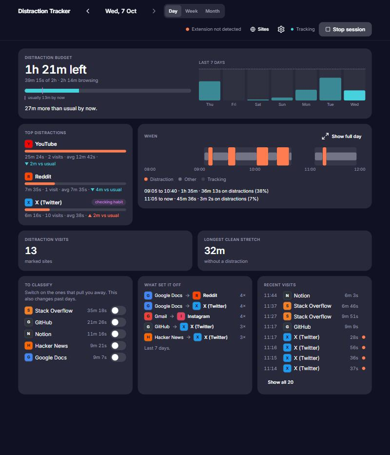
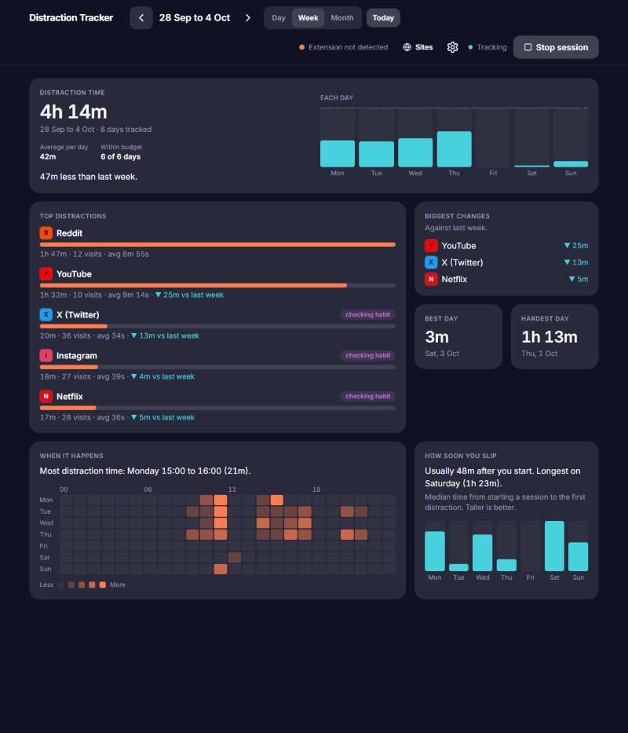
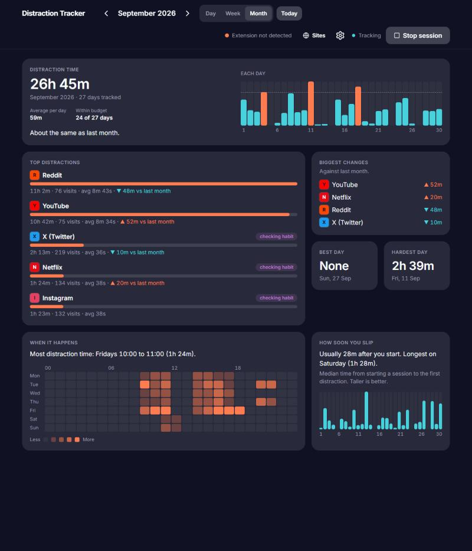
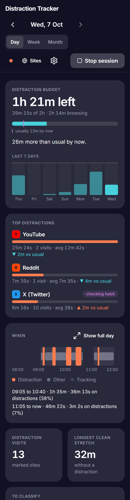
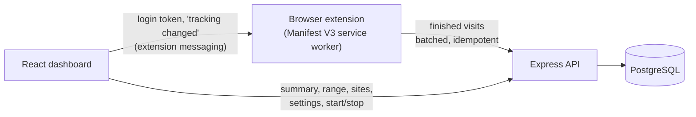

# Distraction Tracker

[](https://github.com/priyanshu-48/distraction-tracker/actions/workflows/ci.yml)

**See where your attention goes, and whether it is getting better.** A Chrome extension records how long you spend on each site while you have a tracking session on. You mark the sites that pull you away, set a daily budget, and a dashboard shows how today, this week and this month compare with what is usual for you.



<table>
  <tr>
    <td width="50%"></td>
    <td width="50%"></td>
  </tr>
  <tr>
    <td align="center"><sub><b>Week:</b> compared with last week over the same days</sub></td>
    <td align="center"><sub><b>Month:</b> 31 bars, the heatmap, biggest changes</sub></td>
  </tr>
</table>

<details>
<summary>On a phone (390 px wide, one column)</summary>
<p align="center"></p>
</details>

<sub>Screenshots use generated demo data (three months of invented browsing), not real browsing.</sub>

## What it does

- **Tracks only while you ask it to.** Start and stop a session from the dashboard; the extension reacts at once.
- **You decide what a distraction is.** Mark a site once and the whole history is recounted (m.youtube.com and youtu.be count as YouTube).
- **Answers the questions that matter**, not just totals:
  - *Am I within my daily budget, and is that normal?* A bar that stretches past the limit, plus "usually 27m by now".
  - *What ate my time, and when?* Ranked sites with a "vs last week" change, a timeline of your sessions, and a weekday-by-hour heatmap.
  - *Is it a habit or a binge?* Many short visits are tagged as a checking habit, long ones as a binge.
  - *Am I getting better?* A like-for-like comparison with the previous period, streaks, and how soon after starting you slip.
- **Optional alerts.** If the server is connected to a notification service and you switch it on in Settings, the extension shows a Chrome notification when you reach 80% of today's budget and when you pass it. Two more arrive on a schedule: a **weekly summary** on Monday morning (last week's distraction time, the change on the week before, days under budget, the biggest site; also sent as an email when the notification service has an email provider) and a message when you reach **3, 7, 14 or 30 days in a row under budget**. Off by default; see [Privacy](#privacy).
- **Your data is yours.** In Settings you can download everything as JSON (or just the visits as a CSV for a spreadsheet), delete your whole history, or delete your account. Deleting asks for your password.
- **Works on a phone-sized screen**, and every chart has a text version for screen readers.

## Engineering highlights

| | What was built | Evidence |
|---|---|---|
| **Correct data, even when things go wrong** | The extension records each visit as one finished interval with a client-generated UUID, queues it, and uploads batches; the server ignores ids it has seen, so a retry never double-counts. The server also keeps **only time that falls inside a tracking session**, cutting a visit at Stop and dropping one recorded after it, so correctness never depends on the extension noticing Stop in time. | Idempotent `POST /api/intervals`; 18 tests with fixed clocks, including boundaries and retries |
| **Fast on a lot of data** | Range predicates on a `(user_id, started_at)` index instead of functions on the column. | The original dashboard queries went from **1,176 ms to 5.7 ms (206x)** on 1M rows ([benchmark](docs/benchmarks/analytics-1m-rows.md)) |
| **One request per screen** | `/api/summary` and `/api/range` return everything a Day, Week or Month view needs, from pure, tested functions plus a few bounded queries. | Day summary **48 ms** p50 on 1M rows; a week 44 to 64 ms, a month 86 to 212 ms for a deliberately extreme user ([Day](docs/benchmarks/day-summary.md), [Week/Month](docs/benchmarks/range-summary.md)) |
| **Honest comparisons** | A week or month in progress is compared with the *same number of days* of the last one; a day with nothing tracked counts as missing, not as zero. | Pure functions with unit tests at every boundary |
| **Tested, and the tests are checked** | Server tests run against a real throwaway PostgreSQL; the extension runs against a fake Chrome. Key rules were also verified by deliberately breaking them and confirming a test fails. | **751 tests** (362 server, 349 client, 40 extension); CI on every push |
| **Privacy by default** | No third-party requests: site names and badges are computed locally (no favicon service). Data stays in your own database, and you can export or delete it. The export streams in batches (bounded memory), and a CSV cell that starts like a spreadsheet formula is neutralised. | See [Privacy](#privacy) |

Details of the trade-offs behind these are under [Design decisions](#design-decisions).

## Architecture



1. You sign in on the dashboard, which hands the extension its own limited token (it can upload visits, nothing else).
2. You press **Start session**. The server opens a session and the extension begins following your active tab.
3. Each time you leave a tab, the extension queues the finished visit and uploads it.
4. The API stores it (cut to the session window) and the dashboard reads the aggregates.

The extension's state lives in `chrome.storage`, not in memory, because Manifest V3 suspends the worker when idle.

## Quick start

### With Docker (the quickest way to see the dashboard)

```bash
docker compose up --build
```

The dashboard is at <http://localhost:5173> and the API at <http://localhost:3000> (stop any local servers first, or set `API_PORT`, `WEB_PORT` and `DB_PUBLISH_PORT`). To fill it with demo data, then sign in as `demo1@example.test` with password `demo-password`:

```bash
docker compose run --rm api node scripts/seed.js --confirm=distraction_tracker --rows 100000
```

### Without Docker

You need Node.js 22 and PostgreSQL 17.

```bash
# API
cd server
cp .env.example .env        # then set DB_PASSWORD and a long random JWT_SECRET
npm install
npm run migrate             # creates the schema (idempotent)
npm start                   # http://localhost:3000, health check at /healthz

# Dashboard (in another terminal)
cd client
cp .env.example .env
npm install
npm run dev                 # http://localhost:5173
```

### The browser extension (needed to record real browsing)

1. Open `chrome://extensions`, turn on **Developer mode**, choose **Load unpacked** and select the `extension/` folder.
2. Copy the extension's ID from that page into `client/.env` as `VITE_EXTENSION_ID`, then restart `npm run dev`.
3. Sign in on the dashboard. The setup banner confirms the extension is connected; press **Start session** and browse.

The extension asks for the `notifications` permission so it can show budget alerts; it is only used if you switch alerts on in Settings (when updating an already loaded copy, reload it at `chrome://extensions`).

The extension talks to `http://localhost:3000` and the dashboard to `http://localhost:5173`; both are fixed in `extension/manifest.json` and `extension/background.js`.

## API

All routes are under `/api` and need a login (the dashboard's httpOnly cookie, or a bearer token) except sign-in, register and the health check.

| Method and path | Purpose |
|---|---|
| `POST /auth/register`, `POST /auth/login` | Create an account, sign in |
| `POST /start-tracking`, `POST /stop-tracking`, `GET /is-tracking` | Start, stop and read the tracking session |
| `POST /intervals` | Upload finished visits (idempotent, cut to the session window) |
| `GET /summary?date=` | Everything the Day view shows |
| `GET /range?view=week\|month&date=` | Everything the Week and Month views show |
| `GET /sites`, `PUT /sites/:domain` | List sites with usage; mark or unmark one as a distraction |
| `GET /settings`, `PUT /settings` | The daily distraction budget |
| `GET /notifications/settings`, `PUT /notifications/settings` | Switch budget alerts on or off (off by default) and the user's time zone |
| `GET /account/export?format=json\|csv` | Download everything (JSON) or the visits only (CSV), streamed |
| `DELETE /account/data`, `DELETE /account` | Delete the history, or the whole account; both need the password in the body |
| `GET /healthz` (no `/api` prefix) | Database check for orchestrators |

Dates are the user's own calendar days; the browser's time zone is sent with each request and checked against PostgreSQL's time zone list.

## Testing and CI

```bash
cd server    && npm test                          # real PostgreSQL, created and dropped by the test run
cd client    && npm test && npm run lint && npm run typecheck
cd extension && node --test "test/*.test.mjs"     # the real background.js against a fake Chrome
```

GitHub Actions runs four jobs on every push and pull request: server tests (with a PostgreSQL service), client lint, typecheck, tests and build, extension tests, and a production dependency audit.

## Design decisions

- **Server as the authority on tracked time.** Telling the extension about Stop (a message from the dashboard) makes it instant, but the server independently cuts visits to the session window. A message can be lost; correctness should not depend on it.
- **Grouping sites in SQL, not rewriting data.** `site_key()` groups `m.youtube.com` with `youtube.com` at read time, so the stored rows are untouched and the rule can change later. It deliberately does *not* merge by registrable domain, which would fuse `docs.google.com` (work) with `mail.google.com`.
- **Streaks and "usual" ignore untracked days** instead of counting them as good or bad: not tracking tells you nothing about your focus.
- **No real-time push.** The dashboard refetches when you return to the tab and every minute while visible. Nothing else changes while you are looking at it, so SSE or WebSockets would add moving parts for no gain.
- **Pure calculations, thin SQL.** The rules (focus stretches, triggers, comparisons, heatmap) are plain functions tested without a database; SQL only fetches bounded ranges.
- **Measured, not assumed.** Several fixes came from timing each query alone, for example a SQL function that PostgreSQL could not inline (300 ms) and an aggregate it sorted on disk instead of hashing.

## Privacy

By default everything stays on your machine and in your own database. The extension sends visits only to the API you configure. It records the **full URL, domain and page title** of each tracked visit, only while a session is on, and never records the dashboard itself. There are no analytics, no third-party requests and no favicon lookups. Recording only the domain is a sensible next option. In Settings, under **Your data**, you can download everything (JSON, or the visits as CSV), delete the history, or delete the account; deleting asks for your password, and a deleted account's login stops working immediately. **Optional notifications are the one exception, and are off unless you turn them on twice:** the server operator sets `NOTIFICATIONS_API_URL` and `NOTIFICATIONS_API_KEY` to connect a notification service, and each user switches alerts on in Settings. Only then are your account id and email, a site name and a time (for example "youtube.com: 40m") sent to that service. URLs and page titles are never sent. Your export includes your notification settings and alerts, deleting your history deletes the alerts, and deleting your history or your account also asks the notification service to erase everything it holds about you (your email and the alerts it was sent). That request is recorded together with the deletion and retried every few minutes until the service confirms, so it is not lost if the service is asleep or unreachable at that moment. The dashboard login is an httpOnly cookie that page scripts cannot read, logging out ends it everywhere, and the extension only holds a token that can upload visits.

## Known limitations

- Chromium browsers only (Chrome, Brave, Edge); the dashboard URL and API URL are fixed to localhost.
- A single daily budget and a per-site mark; no per-site limits or blocking.
- The production client build takes about five minutes; the cause is not yet found.
- Each of the 31 bars in the Month view is narrow on a phone; the Day view's date stepper is the fallback.
- The server still contains the original `/api/analytics` endpoints, which the dashboard no longer calls.
- Budget alerts appear as Chrome notifications within about 30 seconds (the extension's poll interval); this was checked in a real Chrome with the unpacked extension. A live list of alerts in the dashboard is not built yet. The weekly summary and streak messages come from a check every 15 minutes while the server is running, each on the user's own clock (the time zone saved with the switch): the summary is due from Monday 09:00 until the end of Wednesday, and a server that is off for that whole window skips that week; a streak milestone is announced only on the morning after the day it is reached. Alerts use a hosted notification service. Erasure there is confirmed asynchronously: until it confirms (normally within seconds, longer if the service is down), the service still holds your data. Clicking a notification does nothing yet.

## Project structure

```
client/      React 19, Vite, Tailwind 4, TanStack Query (features/day, features/range, features/sites ...)
server/      Express 5, PostgreSQL: routes -> controllers -> models; pure rules in domain/;
             schema in db/migrations/; benchmarks in scripts/bench/
extension/   Manifest V3 service worker (plain JavaScript, no build step) and its tests
docs/        Benchmarks and screenshots
```

## License

Distributed under the [MIT License](LICENSE).
